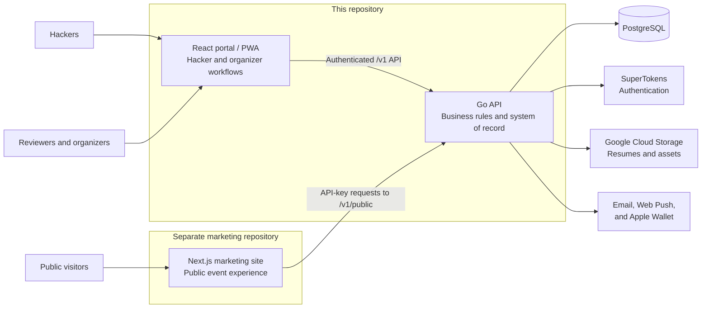

  
  <h1>Harp</h1>
  <h3>Hacker Applications &amp; Review Platform</h3>
  
<strong>A reusable foundation for running a hackathon</strong>

> Harp is under active development.

**Running a hackathon at your school?** [ADOPTING.md](ADOPTING.md) is the whole
setup path — fork, deploy, configure, and redesign it as your own. Harp is a
starting point, not an upstream you have to track.

## What is Harp?

Running a hackathon often means piecing together forms, spreadsheets, email tools, schedules, and check-in systems. Harp brings that work into one place. It helps organizers manage the event from the moment applications open through the final day of the hackathon.

The Go backend sits at the center of Harp. It handles the work behind applications, reviews, acceptances and rejections, schedules, walk-in queues, user access, event settings, and live event data. Two web experiences connect to it:

- The **React portal in this repository** gives hackers, reviewers, organizers, and super admins the tools they need.
- A **Next.js marketing site in a separate repository** introduces the event to the public and pulls changing schedules, FAQs, and sponsor information from the backend.

The marketing site is deliberately kept outside this repository. Teams should begin with the base template and redesign it for every iteration of their hackathon so the site matches that year's theme and identity. The event data and organizer workflows stay in Harp, so creating a fresh public experience does not mean rebuilding the systems behind it.

The same applies to the portal's own applicant-facing pages. What ships here is HackUTD's design, not a neutral baseline — treat it as a starting point and restyle it for your event. The backend, the settings, and your database carry over; the look does not have to.

## Application walkthrough

<!--
Add the product walkthrough GIF to docs/harp-demo.gif, then replace the line
below with:

  

-->

_Demo GIF coming soon._

## What the platform offers

### Hacker experience

- Account creation and secure sign-in
- Configurable, multi-step applications with resume uploads
- Application submission and status tracking
- A personalized event dashboard, schedule, FAQ, and hacker pack
- A personal QR code for fast check-in and activity scans
- Notification feed and opt-in web push notifications
- Points and participation tracking
- Optional Apple Wallet event pass
- Installable portal experience through PWA support

### Applications and admissions

- Custom application sections, fields, and validation
- Searchable applicant records and application statistics
- Reviewer assignment and configurable reviews per application
- Structured voting, reviewer notes, and completed-review history
- Acceptance, rejection, and waitlist status management
- Bulk decision-email delivery and delivery progress
- Walk-in queue management and promotion into the event

### Day-of event operations

- Schedule creation and live updates
- QR scanning for check-in, meals, workshops, and custom activities
- Scan statistics and configurable scan types
- Meal-group configuration and attendance visibility
- Scheduled announcements generated manually or from schedule items
- Hacker-facing schedules, notifications, FAQs, and event resources

### Content and public presence

- Sponsor management, including logos, tiers, and links
- Frequently asked question management
- A public schedule managed from the organizer portal
- API-backed content for the marketing site, keeping fast-changing information in one place
- A separate marketing site template that can be redesigned for every iteration of the hackathon

### Administration and reuse

- Hacker, admin, and super-admin roles with protected workflows
- User search and role management
- Configurable event dates, name, contact details, application deadline, and feature availability
- Granular organizer permissions for schedules, sponsors, and FAQs
- Annual reset workflow that preserves reusable configuration while clearing event-specific activity

## High-level architecture

This repository contains the shared backend and the authenticated portal. The marketing site lives in its own repository and connects to the Go service through the public-content API. Organizers can update schedules, FAQs, and sponsors once, and the separate marketing site can show the latest version without copying that data into its own codebase.

## The three core services

| Service                    | Location                                                              | Responsibility                                                                                                           |
| -------------------------- | --------------------------------------------------------------------- | ------------------------------------------------------------------------------------------------------------------------ |
| **Go backend**             | This repository: `cmd/api`, `internal`                                | Owns business logic, authorization, applications, reviews, decisions, event operations, public content, and persistence. |
| **React portal**           | This repository: `client/portal`                                      | Provides the authenticated hacker, admin, and super-admin experience as a Vite-powered PWA.                              |
| **Next.js marketing site** | [`hackutd/harp-marketing`](https://github.com/hackutd/harp-marketing) | Provides the public event website and renders frequently updated content from the Go public API.                         |

## Marketing site template

The reusable Next.js marketing template lives in its own repository:

**[hackutd/harp-marketing](https://github.com/hackutd/harp-marketing)**

Start from it for each hackathon, then redesign it around the new event's theme while keeping the public API connection in place. It deploys independently to Vercel and reads schedules, FAQs, and sponsors from `/v1/public/*` using a shared `PUBLIC_API_KEY`, so a redesign never touches the backend.

## Technology at a glance

- **Backend:** Go, Chi, PostgreSQL
- **Portal:** React, TypeScript, Vite, Tailwind CSS, shadcn/ui
- **Marketing template, separate repository:** Next.js, React, TypeScript, Tailwind CSS
- **Platform services:** SuperTokens, Google Cloud Storage, email delivery, Web Push, Apple Wallet
- **Delivery:** Docker-based local and production workflows

## Design principle

Hackathon software should make the event easier to run. Harp keeps event content, settings, applicants, schedules, and live operations in one backend. The portal can stay familiar from year to year, while each hackathon gets a newly designed marketing site in its own repository. That gives every event its own personality without forcing the team to rebuild the systems behind it.
